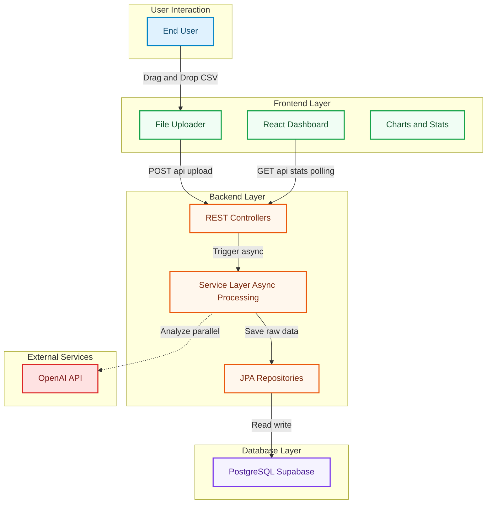
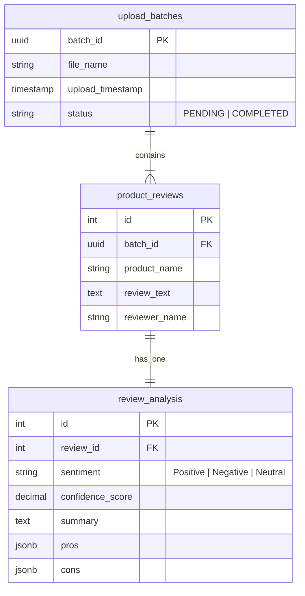

# 📊 AI-Powered Product Sentiment Dashboard


> **Transform raw customer feedback into actionable strategic insights in seconds.**

---

## 📖 Overview

The **Product Review Sentiment & Summary Dashboard** is a full-stack analytical tool designed to help e-commerce businesses understand their customers instantly. 

Instead of manually reading thousands of rows of CSV data, this system ingests raw review files, processes them using **Large Language Models (LLMs)** in parallel, and visualizes the results on a modern, glassmorphic dashboard. It identifies recurring themes (Pros/Cons), calculates sentiment trends, and generates executive summaries automatically.

---

## ✨ Key Features

### 1. Intelligent Analysis
- **Automated Sentiment Scoring:** Classifies reviews as Positive, Neutral, or Negative with high precision
- **Theme Extraction:** Dynamic identification of top "Pros" and "Cons" across thousands of reviews
- **Executive Summaries:** Auto-generates a human-readable "Verdict" text (e.g., "Highly Recommended") based on aggregate data

### 2. High-Performance Engineering
- **Asynchronous Processing:** Java `CompletableFuture` ensures the UI remains responsive while the backend crunches data in the background
- **Parallel Execution:** Fast multi-threaded processing of review batches (5x faster than sequential)
- **Live Polling:** Real-time status updates on the dashboard using a smart polling mechanism

### 3. Modern UI/UX
- **Glassmorphism Design:** A stunning dark-mode interface built with **Tailwind CSS**
- **Interactive Visualizations:** Dynamic Pie Charts and Bar Graphs using **Recharts**
- **Smart Filtering:** Automatically detects products in the CSV and allows instant filtering by Product Name

---

## 📂 Project Structure

A high-level overview of the codebase organization.

### **Backend (Spring Boot)**
The core logic resides in `src/main/java/com/github/ani/llm_review_analysis/`.

```text
backend/
├── config/
│   └── WebConfig.java           # Global CORS configuration allowing frontend access
├── controller/
│   ├── ReviewController.java    # Handles CSV file upload & parsing requests
│   └── DashboardController.java # Endpoints for fetching stats, charts, and filtering logic
├── model/
│   ├── ProductReview.java       # Entity mapping for raw CSV data
│   └── ReviewAnalysis.java      # Entity for AI results (stores JSONB pros/cons)
├── repository/
│   └── AnalysisRepository.java  # Optimized SQL queries for aggregating sentiment stats
└── service/
    ├── ReviewService.java       # The "Brain". Handles Async orchestration & Parallel Stream logic
    └── OpenAiService.java       # Manages communication with GPT-3.5 API
```

### **Frontend (React + Vite)**
The UI is built with a component-first architecture in `src/`.

```text
frontend/
├── src/
│   ├── components/
│   │   ├── charts/              # Reusable Recharts components (Pie & Bar)
│   │   ├── ui/                  # Shadcn/Tailwind UI primitives (Buttons, Cards)
│   │   ├── Dashboard.tsx        # Main view. Handles polling, state, and product filtering
│   │   ├── FileUpload.tsx       # Drag & Drop zone with animation states
│   │   └── SummaryInsights.tsx  # Generates the "Executive Summary" text block
│   ├── pages/
│   │   └── Index.tsx            # Route handling and layout wrapper
│   └── App.tsx                  # Global providers (QueryClient, Toaster)
```

---

## 🏗️ System Architecture

The system follows a modern 3-Tier Microservices-ready Architecture, decoupling the high-performance backend from the interactive frontend.



---

## 💾 Database Schema

The database is designed with normalization and scalability in mind, separating raw ingestion data from AI-generated insights.



### Table Breakdown

| Table | Purpose | Key Feature |
|-------|---------|-------------|
| `upload_batches` | Tracks every file upload attempt | Manages the Async State (PROCESSING vs COMPLETED) to enable the live loading UI |
| `product_reviews` | Stores the raw CSV data exactly as uploaded | Decouples the original data from the analysis, allowing re-analysis if the AI model changes |
| `review_analysis` | Stores the LLM outputs | Uses PostgreSQL JSONB columns for pros and cons, enabling flexible, schema-less storage of list data |

---

## 🛠️ Tech Stack

### Frontend
- **Framework:** React 18 (Vite)
- **Styling:** Tailwind CSS, Framer Motion
- **Visualization:** Recharts
- **State Management:** React Hooks
- **HTTP Client:** Axios

### Backend
- **Framework:** Spring Boot 3.3.0 (Java 17)
- **Database:** PostgreSQL (via Supabase) with JSONB support
- **ORM:** Spring Data JPA (Hibernate)
- **CSV Parsing:** OpenCSV
- **Concurrency:** Java CompletableFuture & Stream API

---

## Getting Started

Follow these steps to set up the project locally.

### Prerequisites
- Java 17 or higher
- Node.js and npm
- Supabase Project (PostgreSQL)
- OpenAI API Key

### Clone the Repository

```bash
git clone https://github.com/yourusername/llm-review-analysis.git
cd llm-review-analysis
```

### Backend Setup

Navigate to the backend folder and configure your environment variables.

1. Open `src/main/resources/application.properties`

2. Update the following credentials:

```properties
# Database Configuration (Supabase)
spring.datasource.url=jdbc:postgresql://[YOUR_SUPABASE_HOST]:5432/postgres?sslmode=require
spring.datasource.username=postgres
spring.datasource.password=[YOUR_DB_PASSWORD]

# OpenAI Configuration
openai.api.key=[YOUR_OPENAI_API_KEY]
openai.model=gpt-3.5-turbo
```

3. Run the Backend:

```bash
mvn spring-boot:run
```

The server will start on `http://localhost:8080`

### Frontend Setup

Navigate to the frontend folder.

```bash
cd frontend
npm install
npm run dev
```

The application will be accessible at `http://localhost:5173`

---

## 🧪 Usage Guide

1. **Prepare Data:** Create a CSV file with columns: `id`, `product_name`, `review_text`, `reviewer_name`

2. **Upload:** Drag and drop the CSV into the dashboard

3. **Analyze:** Monitor the live analysis badge as the backend processes reviews in real-time

4. **Explore:**
   - Filter by specific products using the dropdown
   - View the calculated executive summary
   - Hover over charts to see detailed sentiment breakdowns